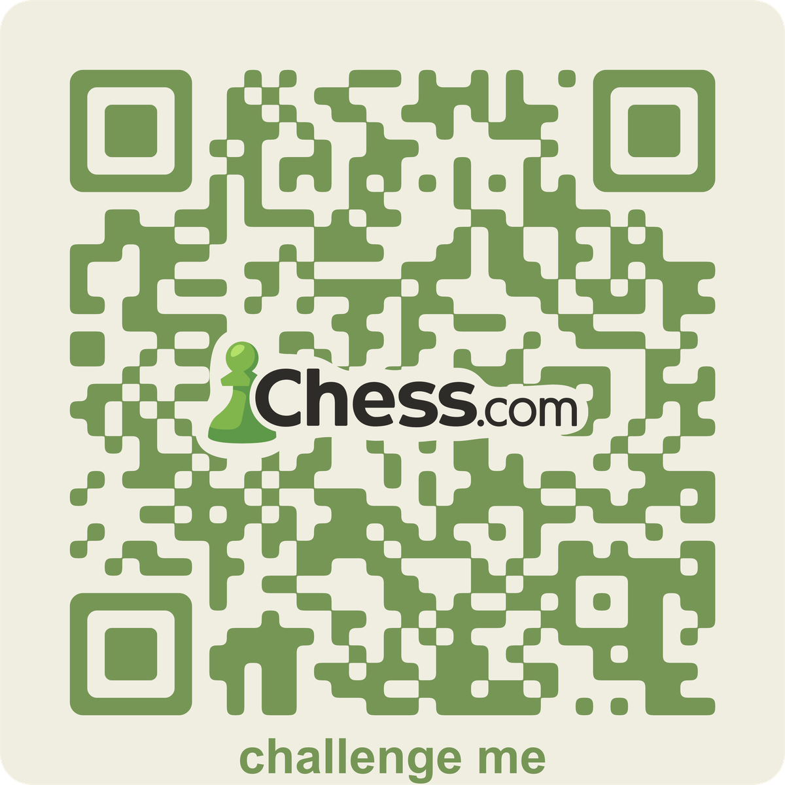

I wanted a sticker I could put on my laptop that lets anyone challenge me on chess.com by pointing their phone at it. The obvious answer is a QR code, but a plain black-and-white QR code looks like a parking meter. So I wrote a ~150 line Python script that renders one in chess.com's green-on-cream palette with rounded modules and the logo dropped into the middle.



<!-- truncate -->

That image is live — scanning it opens [my chess.com profile](https://www.chess.com/member/thecasualwaffle).

## Rounding every corner without any corner logic

The part of this I actually like is how the modules get rounded. The naive approach is to draw each dark module as a rounded rectangle, but that leaves visible gaps wherever two modules touch, so you end up writing per-junction logic: is my neighbor to the north filled? north-east? Which of my four corners should be round and which should be square? It's a pile of cases and it still looks wrong at the T-junctions.

Instead I render the QR as a hard binary mask of plain squares, blur it, and then threshold it back to binary:

```python
blurred = mask.filter(ImageFilter.GaussianBlur(radius=blur_r))
arr = np.array(blurred)
rounded_arr = (arr > 128).astype(np.uint8) * 255
```

A Gaussian blur turns a sharp corner into a gradient that falls off fastest right at the corner point, so thresholding at the midpoint cuts the corner off in a smooth arc. Convex corners get rounded outward, concave corners (where two modules meet at right angles) get filled inward with a matching arc, and long straight runs are untouched because the blur is symmetric along an edge. One blur, one comparison, no special cases — and it handles every junction shape identically because it never knows what a "junction" is.

`BLUR_FACTOR = 0.18` (as a fraction of module size) is about as far as you can push it before thin diagonal connections start pinching off.

The three finder patterns are the exception. Blurring turns those big concentric squares into blobby rounded rectangles at an inconsistent radius, so after the blur pass I just clear each 7×7 finder region and redraw it as three concentric `rounded_rectangle` calls with hand-picked radii.

## Putting a logo in the middle of a QR code

You get to destroy a chunk of a QR code for free because of Reed–Solomon error correction. At `ERROR_CORRECT_H` roughly 30% of the modules can be unreadable and the payload still recovers, which is plenty of headroom for a centered logo.

The logo needs to be visually separated from the modules underneath, and a plain rectangular cream box behind it looks cheap. So the border follows the logo's actual contour, using the same blur-and-threshold trick applied to the alpha channel:

```python
alpha_mask = logo_alpha.point(lambda p: 255 if p > 20 else 0)
dilated_mask = alpha_mask.filter(ImageFilter.GaussianBlur(radius=blur_radius))
dilated_mask = dilated_mask.point(lambda p: 255 if p > 18 else 0)
```

Thresholding a blurred mask *below* the midpoint dilates it instead of preserving it, so this is a cheap morphological dilation that produces a smooth outline hugging the pawn and the letterforms. That cream contour is painted first, the logo goes on top, and the whole thing is composited over the center of the code. The logo canvas gets padded before blurring, otherwise the dilation gets clipped at the edges.

## Running it

```
pip install "qrcode[pil]" pillow numpy
python generate_sticker.py "https://www.chess.com/member/thecasualwaffle" out.png
```

Args are `URL`, `output path`, and optionally a `logo path`. It renders at 8192×8192 so it stays crisp at print sizes; the module size is `8192 // N`, so the output is actually the largest multiple of the module count that fits, then padded back to 8192.

You can point it at a direct challenge link (`https://link.chess.com/play/...`) instead of a profile URL if you want the scan to open a game invite rather than a profile — the shorter URL also drops the QR to a lower version with chunkier, easier-to-scan modules.

The full script is [in this post's folder in the site repo](https://github.com/msdrigg/scottdriggers-web/tree/main/blog/2026-08-01-chess-com-challenge-qr-sticker).
